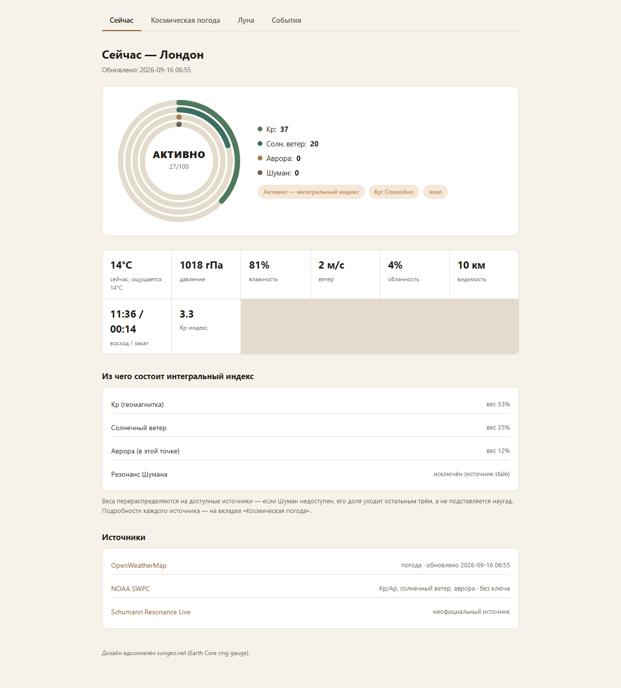

# weather-monitor

One dashboard that answers a single question — **"is today calm, or not?"** — by blending weather, geomagnetic activity, earthquakes/wildfires, news volume, and market volatility into one integral index. [**Live demo →**](https://puginanatoly-stack.github.io/weather-monitor/) (neutral placeholder city, no history)

[](https://puginanatoly-stack.github.io/weather-monitor/)
[](https://github.com/puginanatoly-stack/weather-monitor/actions/workflows/deploy-pages.yml)
[](https://github.com/puginanatoly-stack/weather-monitor/actions/workflows/daily-check.yml)
[](LICENSE)

Русская версия: [README.ru.md](README.ru.md)



## What it does

Every day (GitHub Actions, once a day) it pulls from ten free/keyless APIs, computes one weighted **activity index**, renders a 4-tab static site, and — if anything crossed a threshold — pings Telegram:

- **Weather** — OpenWeatherMap (current + forecast)
- **Space weather** — NOAA SWPC (Kp/Ap index, solar wind, aurora probability) + Schumann resonance (best-effort, honestly flagged when stale)
- **Natural events** — NASA EONET (storms/wildfires/ice) + USGS (significant earthquakes)
- **"Digital noise"** — publication frequency across BBC / Google News / Al Jazeera / RIA Novosti RSS, as an indirect activity signal
- **Markets** — daily % change on 5 baseline tickers (S&P 500, VIX, MOEX, USD/RUB, EUR/USD) via the Yahoo Finance chart API

Design is inspired by sungeo.net — earth-tone palette, ring gauge, status badges.

### The Sri Lanka case

A second, independent index tracks **hazard risk for a specific coastal point** — the same EONET/USGS feeds, geo-filtered by radius (earthquakes within 2500 km and no older than a configurable age cutoff, storms within 1500 km), with its own weighted scoring (`compute_sri_lanka_index` in `composite.py`). It started as personal risk-monitoring for a place the author cares about and stayed in as a worked example of the trap of a stale-but-technically-in-window event silently pinning an index for weeks (see the age-cutoff fix, `SRI_LANKA_QUAKE_MAX_AGE_DAYS`, documented in the code). Always shown in the Telegram notification alongside live sea/air temperature and wind for the coast, regardless of whether a trigger fired — see [Automation](#how-the-automation-works) below.

The scoring/filtering logic isn't tied to Sri Lanka specifically — swapping the coordinates and radii in `sources.py` repoints it at any coastal location.

## Run it locally

```bash
pip install -r requirements.txt
export OPENWEATHERMAP_API_KEY=...   # openweathermap.org/api, free tier
python build.py "London,GB"          # or any other city — no args builds the same placeholder demo published on Pages
```

Open the generated `index.html` in a browser.

## Data sources (all keyless except OpenWeatherMap)

| Source | What it provides |
|---|---|
| OpenWeatherMap | current weather + forecast |
| NOAA SWPC | Kp/Ap index, solar wind, aurora probability |
| Schumann Resonance Live | Schumann resonance (unofficial source, honestly flagged when stale) |
| NASA EONET | open natural-event feed (storms feed the coastal-hazard index) |
| USGS | significant earthquakes, filtered to a recent window (feeds the coastal-hazard index) |
| Open-Meteo / Open-Meteo Marine | air temperature, wind, sea temperature for the coastal point |
| BBC / Google News / Al Jazeera / RIA Novosti (RSS) | "digital noise" — publication frequency as an indirect indicator |
| Yahoo Finance chart API | S&P 500, VIX, MOEX, USD/RUB, EUR/USD — daily % change |

## How the automation works (`.github/workflows/daily-check.yml`)

This repository is public and holds only code — neither the real city nor the run history is committed here (see `.gitignore` and the docstrings in `build.py`/`history_sync.py`): a public git history growing on a schedule would quietly leak geolocation and usage patterns. So:

1. **History** (`data/history.jsonl`) is synced with a separate private repo via `history_sync.py` (pull before build, push after) — never written to this public repo.
2. **Generated HTML pages** are never committed either — each run's output is throwaway, not a persistent site. (The `demo/` folder is the one deliberate exception — see below.)
3. **Alert condition** (`notify.py`): by default (`NOTIFY_MODE=always`, the settled mode) a Telegram notification goes out on every run regardless of trigger — the coastal-hazard block is always visible in it. If `NOTIFY_MODE=condition` is explicitly set, it only sends when a trigger actually fired: the integral index ≠ "Calm", OR market volatility / news volume is notably (>1.5×) above its historical average (once enough history has accumulated), OR the coastal-hazard index ≠ "Calm" (a ~M5.75+ earthquake within 2500 km in the last few days, or an active storm in the basin).

### Repository secrets (Settings → Secrets and variables → Actions)

| Secret | Purpose |
|---|---|
| `OPENWEATHERMAP_API_KEY` | weather API key |
| `WEATHER_CITY` | e.g. `London,GB` — never stored in code |
| `HISTORY_PUSH_TOKEN` | GitHub PAT with write access to the private history repo |
| `TELEGRAM_MOTION_BOT_TOKEN` | Telegram bot token for alerts |
| `TELEGRAM_MOTION_CHAT_ID` | where to send the alert |
| `NOTIFY_MODE` | optional; `always` (default if unset) or `condition` — see above |

## The `demo/` folder and GitHub Pages

`demo/` is a one-time, committed build for a neutral placeholder city (London) — the one deliberate exception to "nothing generated gets committed," precisely because it carries no real location or history. `.github/workflows/deploy-pages.yml` publishes it to GitHub Pages on every push to `demo/`; it's a separate workflow from `daily-check.yml` and never touches the real automation. To refresh the demo after a UI change: run `python build.py` (no args → the default placeholder city), copy the four HTML files into `demo/`, commit.

## Files

- `sources.py` — fetches data from every source
- `moon.py` — moon phase, pure calculation, no API
- `composite.py` — the integral activity index (normalization + weighted blend) + the separate coastal-hazard index
- `charts.py` — SVG line/bar/ring charts
- `templates.py` — shared page shell (nav, CSS)
- `pages.py` — each tab's body
- `build.py` — entry point: collects data, computes the index, writes history + summary, renders 4 HTML files
- `history_sync.py` — pull/push `data/history.jsonl` to/from the private history repo
- `notify.py` — checks the alert condition, sends to Telegram
- `.github/workflows/daily-check.yml` — schedule + steps
- `.github/workflows/deploy-pages.yml` — publishes `demo/` to GitHub Pages

## Contributing

See [CONTRIBUTING.md](CONTRIBUTING.md). Issues and PRs welcome.

## License

[MIT](LICENSE)
